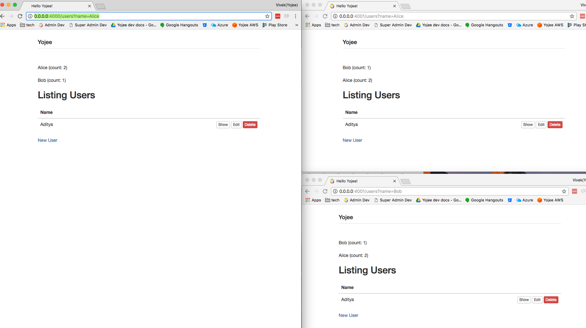

# YojeeChatExample
This is an example to test distributed deployment

# Prerequisites
- elixir 1.6
- postgres
- npm/node

# Related Links for production deployment
- phoenix  https://hexdocs.pm/phoenix/deployment.html
- Libcluster https://github.com/bitwalker/libcluster
- libcluster ec2 plugin https://github.com/kyleaa/libcluster_ec2
- distillery https://github.com/bitwalker/distillery
- edeliver https://github.com/edeliver/edeliver

# Dev Setup

1) Get dependencies
```
mix deps.get
cd assets
npm install # This is to install assets

```
2) Configure your db in `config/dev.exs`and ideally in `prod.exs` for production deployment.

 Username and password need to go here.
```
# Configure your database
config :yojee_chat_example, YojeeChatExample.Repo,
  adapter: Ecto.Adapters.Postgres,
  database: "yojee_chat_example_dev",
  hostname: "localhost",
  pool_size: 10
```

3)  Create and migrate database
```
mix ecto.create
mix ecto.migrate
```
This creates a table called postgres

4) Run two nodes on different ports to simulate two different servers/nodes
```
PORT=4000  iex --name a@127.0.0.1 -S mix phx.server
PORT=4001  iex --name b@127.0.0.1 -S mix phx.server
```

5) Please be aware of the configuration in `config/config.exs` for libcluster.
This is using Epmd locally but ideally based on ec2 tags on production
```
config :libcluster,
  topologies: [
    ycluster: [
      # The selected clustering strategy. Required.
      strategy: Cluster.Strategy.Epmd,
      # Configuration for the provided strategy. Optional.
      config: [hosts: [:"a@127.0.0.1", :"b@127.0.0.1", :"c@127.0.0.1"]],
    ]
  ]
```

6) Open different three different tabs with the links
```
http://0.0.0.0:4000/users?name=Alice
http://0.0.0.0:4001/users?name=Alice
http://0.0.0.0:4001/users?name=Bob
```
Two tabs are connecting to node `b` on port 4001.
One tab are connecting to node `a` on port 4000.

libcluster auto connects node `a` and `b` based on config. Presence information is propagated between all tabs.



